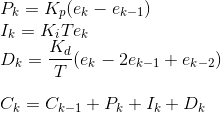
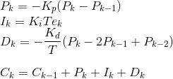

# PID Controller

## Basics

PID stands for Proportional-Integral-Derivative. This is a type of feedback controller whose output, a control variable (C), is generally based on the error between some user-defined set point (S) and some measured process variable (P). Each element of the PID controller refers to a particular action taken on the error:

#### Proportional

The error is multiplied by a gain, Kp. This is an adjustable amplifier. In many systems Kp is responsible for process stability: too low and the P can drift away; too high and the P can oscillate.

#### Integral

The integral of the error multiplied by a gain, Ki. In many systems Ki is responsible for driving error to zero, but to set Ki too high is to invite oscillation or instability or integrator windup or actuator saturation.

#### Derivative

The rate of change of the error is multiplied by a gain, Kd. In many systems Kd is responsible for system response: too low and the P will oscillate; too high and the P will respond sluggishly. The designer should also note that derivative action amplifies any noise in the error signal.

## Usage

Tuning of a PID involves the adjustment of Kp, Ki, and Kd to achieve some user-defined "optimal" character of system response.

Although many architectures exist for control systems, the PID controller is mature and well-understood by practitioners. For these reasons, it is often the first choice for new controller design. It satisfies Occam's Razor in being the simplest solution for most cases.

## Implementation

A simple digital implementation of a PID controller, in which rectangular integration is assumed, is as follows:

<!-- P_k = K_p ( e_k - e_{k-1} ) \\ I_k = K_i  T  e_k \\ D_k = \frac {K_d}{T} ( e_k - 2  e_{k-1} + e_{k-2} ) \\ \\ C_k = C_{k-1} + P_k + I_k + D_k -->

where ek = Sk - Pk, and T is the sampling interval.

This is referred to as two-degree-of-freedom (two-DOF) design. Notice for this implementation it's assumed that all three controller actions involve ek.

Many practitioners try to avoid this: applying Kp and/or Kd to the set point can magnify transient errors introduced by rapid changes to the S. Consider the alternative implementation, in which Kp and Kd are applied only to the P:

<!-- P_k = - K_p ( P_k - P_{k-1} ) \\ I_k = K_i  T  e_k \\ D_k = - \frac {K_d}{T} (P_k - 2 P_{k-1} + P_{k-2} ) -->

... which is one-DOF.

Source: http://www.tcnj.edu/~rgraham/PID-tuning.html
